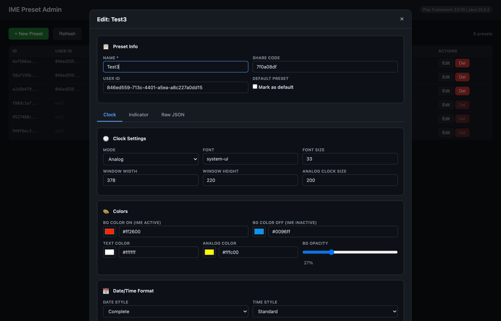

[English](README.md) | [日本語](README_ja.md)

# Play IME Preset API

A REST API server for managing IME indicator clock presets, built with **Play Framework 3.0** and **Java 21**.

Connects to a Supabase PostgreSQL database (same schema as [IME Simulator](https://obott9.github.io/ime-simulator/)) to provide full CRUD operations on preset configurations. Includes a built-in admin dashboard for browser-based data management.

## Screenshots

| Admin Dashboard | Preset Editor |
|:---:|:---:|
|  |  |

## Tech Stack

| Component | Technology |
|-----------|-----------|
| Framework | [Play Framework 3.0.10](https://www.playframework.com/) (Pekko-based) |
| Language | Java 21 (LTS) |
| ORM | [Ebean](https://ebean.io/) (Play standard Java ORM) |
| Database | PostgreSQL ([Supabase](https://supabase.com/)) |
| Build | sbt 1.10 |

## Features

- **Full CRUD** — Create, read, update, delete presets via REST API
- **Admin Dashboard** — Browser-based UI at `/admin` with visual settings editor (color pickers, sliders, per-language indicator config)
- **Pagination** — Configurable page size with total count
- **Share Codes** — Unique codes for preset sharing
- **Like System** — Toggle likes with user tracking
- **Popular Presets** — Ranked by like count
- **Health Check** — Server status endpoint

## API Endpoints

| Method | Path | Description |
|--------|------|-------------|
| `GET` | `/admin` | Admin dashboard (browser UI) |
| `GET` | `/api/presets` | List presets (paginated) |
| `GET` | `/api/presets/:id` | Get preset by ID |
| `POST` | `/api/presets` | Create preset |
| `PUT` | `/api/presets/:id` | Update preset |
| `DELETE` | `/api/presets/:id` | Delete preset |
| `GET` | `/api/presets/shared/:code` | Get by share code |
| `POST` | `/api/presets/:id/like` | Toggle like |
| `GET` | `/api/presets/popular` | Popular presets |
| `GET` | `/api/health` | Health check |

## Setup

### Prerequisites

- Java 21+
- sbt 1.9+

### 1. Create Supabase Project

1. Create a free project at [supabase.com](https://supabase.com)
2. Open **SQL Editor** and run `supabase-setup.sql` to create tables and seed data

### 2. Configure Environment

```bash
cp .env.example .env
```

To find your Supabase credentials:
1. Open your Supabase project dashboard
2. Click **Connect** (top bar)
3. Select **Direct** tab > **Session pooler**
4. Copy `host`, `port`, and `user` values
5. DB password is what you set when creating the project (can be reset in Database Settings)

### 3. Run

```bash
export $(cat .env | xargs) && sbt run
```

Open `http://localhost:9000/admin` in your browser.

### Example API Requests

```bash
# Health check
curl http://localhost:9000/api/health

# List presets (paginated)
curl http://localhost:9000/api/presets

# Default presets only
curl "http://localhost:9000/api/presets?defaultOnly=true"

# Popular presets (top 5)
curl "http://localhost:9000/api/presets/popular?limit=5"
```

## Project Structure

```
app/
  controllers/
    PresetController.java    # REST API endpoints
  models/
    Preset.java              # Ebean entity model
    Like.java                # Like entity model
conf/
  application.conf           # Play + Ebean + CORS config
  routes                     # URL routing
public/
  admin.html                 # Admin dashboard (single-file SPA)
```

## Related Projects

| Project | Description |
|---------|-------------|
| [play-ime-preset-dashboard](https://github.com/obott9/play-ime-preset-dashboard) | Same API in **Scala 3** + Slick + Pekko Streams |
| [IME Simulator](https://github.com/obott9/ime-simulator) | React frontend that consumes this API |
| [IMEIndicatorClock](https://github.com/obott9/IMEIndicatorClock) | macOS desktop app that uses these presets |
| [IMEIndicatorClockW](https://github.com/obott9/IMEIndicatorClockW) | Windows desktop app that uses these presets |

## Note

The admin dashboard is for **local development and demonstration only**. It provides unrestricted access to all data without authentication. For production use, the [IME Simulator](https://github.com/obott9/ime-simulator) frontend implements Supabase Auth with ownership-based access control.

## Development

This project was developed in collaboration with [Claude AI](https://claude.ai/) by Anthropic.

Claude assisted with:
- Architecture design and code implementation
- Admin dashboard UI development
- Documentation and README creation

## License

[MIT](LICENSE)

## Support

If you find this project useful:

[](https://github.com/sponsors/obott9)
[](https://ko-fi.com/obott9)
[](https://buymeacoffee.com/obott9)
